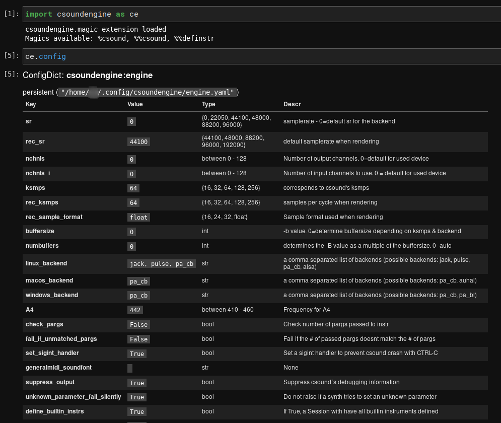
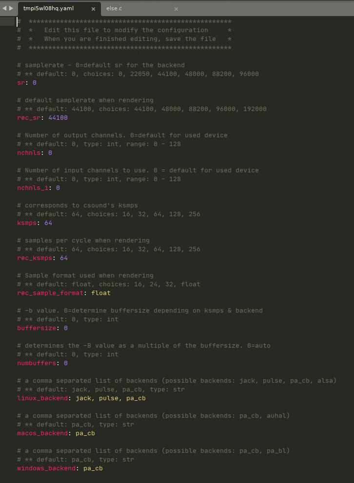

.. _configuration:

=============
Configuration
=============

Many defaults can be configured via :py:obj:`csoundengine.config.config` (an instance 
of :class:`configdict.ConfigDict`, see https://configdict.readthedocs.io).

.. note::

    To modify defaults in a persistent manner, call :meth:`ConfigDict.save`
    to save the current version. The changes will be loaded the next time this
    module is imported

Example
=======

.. code::

    import csoundengine as ce
    # Modify the default number of channels, force it to 2
    ce.config['nchnls'] = 2

    # Set default A4 value 
    ce.config['A4'] = 443

    # Larger number of audio buses
    ce.config['num_audio_buses'] = 200

    # If you would like to set these as defaults, call save. The next time using
    # csoundengine, these settings will be the default.
    ce.config.save()

    # To revert the changes to the default, use reset:
    ce.config.reset()

    
Any :class:`~csoundengine.engine.Engine` created after this will pick up these
new defaults::

    >>> from csoundengine import *
    >>> engine = Engine()
    >>> engine.numAudioBuses
    200
    >>> engine.A4
    443

Edit the config interactively
-----------------------------

.. code::

    from csoundengine import *
    config.edit()

This will open the config in a text editor and any changes there will be reflected back in
the config. Which application is used depends on the os settings for handling yaml files.

-----

.. _configkeys:
    
Keys
====

.. include:: configkeys.rst
