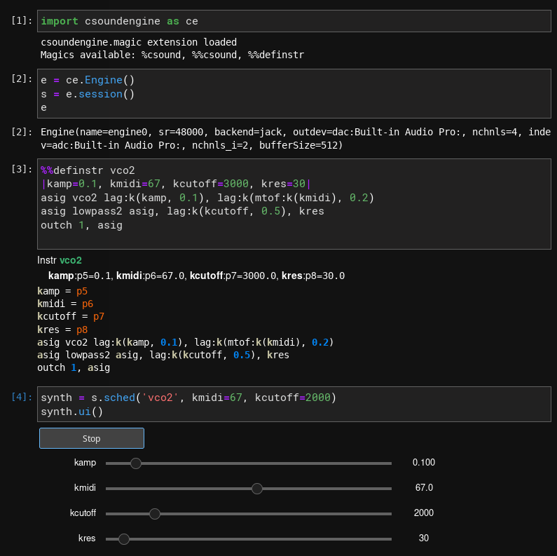

.. csoundengine documentation master file, created by
   sphinx-quickstart on Sun Jan 31 20:13:32 2021.
   You can adapt this file completely to your liking, but it should at least
   contain the root `toctree` directive.

csoundengine - Documentation
============================

**csoundengine** is a library to run and control a `csound <https://csound.com>`_
process for **realtime** or **offline** sound processing.

Interaction with *csound* is through its API using
`libcsound <https://github.com/csound-plugins/libcsound>`_.
See the `Csound FLOSS manual <https://flossmanual.csound.com/introduction/preface>`_
to learn more about csound and its syntax and run examples online. **csoundengine**
is compatible with any recent version of csound6 (>= 6.16) and csound7

The source code of this package is hosted at https://github.com/gesellkammer/csoundengine

----------------------------

----------------------------

Contents
--------

.. toctree::
   :maxdepth: 2

   Introduction
   Installation
   Reference
