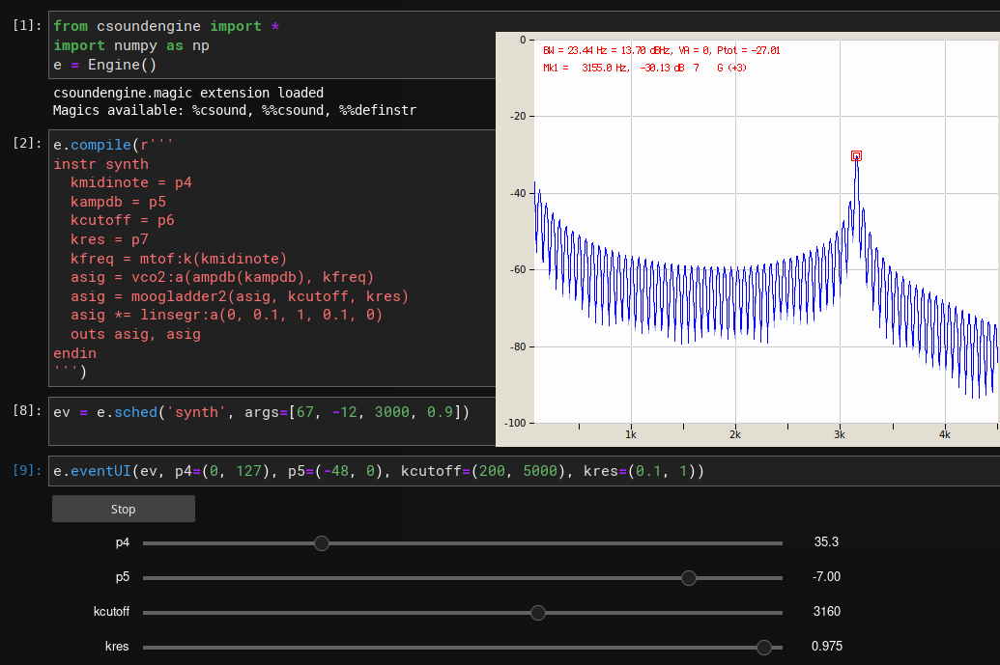
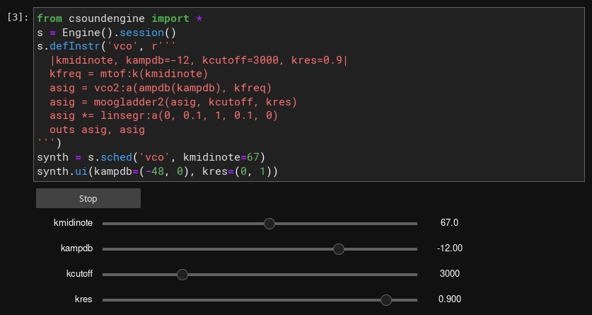

.. _jupyternotebook:

Csoundengine inside a Jupyter Notebook
======================================

Many operations by an :class:`~csoundengine.engine.Engine`, a :class:`~csoundengine.session.Session`
or a :class:`~csoundengine.synth.Synth` provide specialized output when run inside a jupyter
notebook, leveraging jupyter's html display framework.

Event UI
--------

*csoundengine* can generate an interactive UI widget to control an event scheduled by an
Engine or a Synth scheduled by a Session.
For events scheduled within an Engine, this is possible whenever the instrument uses
dynamic pargs (the parg is assigned to a k-rate variable), as shown below:

.. code::

    from csoundengine import *
    e = Engine()
    e.compile(r'''
    instr synth
      kmidinote = p4
      kampdb = p5
      kcutoff = p6
      kres = p7
      kfreq = mtof:k(kmidinote)
      asig = vco2:a(ampdb(kampdb), kfreq)
      asig = moogladder2(asig, kcutoff, kres)
      asig *= linsegr:a(0, 0.1, 1, 0.1, 0)
      outs asig, asig
    endin
    ''')
    ev = e.sched('synth', args=[67, -12, 3000, 0.9])
    e.eventUI(ev, p4=(0, 127), p5=(-48, 0), kcutoff=(200, 5000), kres=(0.1, 1))

A similar interactive widget can be generated from a :class:`~csoundengine.synth.Synth`:

.. code::

    # Inside jupyter
    from csoundengine import *
    s = Engine().session()
    s.defInstr('vco', r'''
      |kmidinote, kampdb=-12, kcutoff=3000, kres=0.9|
      kfreq = mtof:k(kmidinote)
      asig = vco2:a(ampdb(kampdb), kfreq)
      asig = moogladder2(asig, kcutoff, kres)
      asig *= linsegr:a(0, 0.1, 1, 0.1, 0)
      outs asig, asig
    ''')
    synth = s.sched('vco', kmidinote=67)
    # Specify the ranges for some sliders. All named parameters
    # are assigned a widget
    synth.ui(kampdb=(-48, 0), kres=(0, 1))

