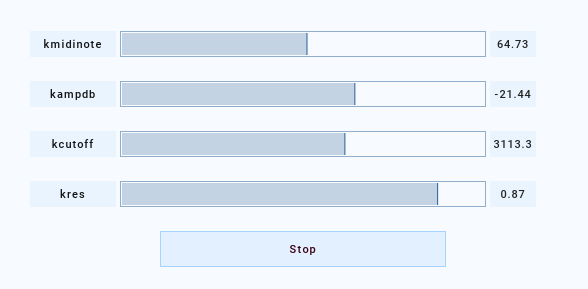

Session – High-level interface
==============================

.. contents::
   :depth: 3
   :local:
   :backlinks: none

Overview
--------

*   A Session uses instrument templates (:class:`~csoundengine.instr.Instr`), which
    enable an instrument to be instantiated at any place in the evaluation chain.
*   An instrument template within a Session can also declare default values for pfields
*   Session instruments can declare named controls. These are dynamic parameters which
    can be modified and automated over the lifetime of an event
    (:meth:`Synth.set <csoundengine.synth.Synth.set>`,
    :meth:`Synth.automate <csoundengine.synth.Synth.automate>`)

1. Instrument Templates
~~~~~~~~~~~~~~~~~~~~~~~

In csound there is a direct
mapping between an instrument declaration and its order of evaluation. Within a
:class:`Session`, on the other hand, it is possible to declare an instrument (
:class:`~csoundengine.instr.Instr`) and instantiated it at any order,
making it possibe to create chains of processing units.

.. code-block:: python

    s = Engine().session()
    # Notice: the filter is declared before the generator. If these were
    # normal csound instruments, the filter would receive an instr number
    # lower and thus could never process audio generated by `myvco`
    Instr('filt', r'''
        Schan strget p5
        kcutoff = p6
        a0 chnget Schan
        a0 moogladder2 a0, kcutoff, 0.9
        outch 1, a0
        chnclear Schan
    ''').register(s)

    # The same can be achieved via Session.defInstr:

    s.defInstr('myvco', r'''
        kfreq = p5
        kamp = p6
        Schan strget p7
        a0 = vco2:a(kamp, kfreq)
        chnset a0, Schan
    ''')
    synth = s.sched('myvco', kfreq=440, kamp=0.1, Schan="chan1")

    # The filter is instantiated with a priority higher than the generator and
    # thus is evaluated later in the chain.
    filt = s.sched('filt', priority=synth.priority+1, kcutoff=1000, Schan="chan1")

2. Named pfields with default values
~~~~~~~~~~~~~~~~~~~~~~~~~~~~~~~~~~~~

An :class:`~csoundengine.instr.Instr` (also declared via :meth:`~Session.defInstr`)
can define default values for its pfields via the ``pset`` opcode
(http://www.csounds.com/manual/html/pset.html). When scheduling an event the user only
needs to fill the values for those pfields which differ from the given default.
Notice that **p4 is reserved and cannot be used**

.. code-block:: python

    s = Engine().session()
    s.defInstr('sine', r'''
        pset p1, p2, p3, 0, 0.1, 1000
        iamp = p5
        kfreq = p6
        a0 = oscili:a(iamp, kfreq)
        outch 1, a0
    ''')
    # We schedule an event of sine, iamp will take the default (0.1)
    synth = s.sched('sine', kfreq=440)
    # pfields assigned to k-variables can be modified by name
    synth.set(kamp=0.5)

3. Dynamic Controls
~~~~~~~~~~~~~~~~~~~

An Instr can define a number of **named controls**, similar to pfields. These
controls must have a valid csound name (starting with 'k') and can
define a default value. They provide a more efficient way of controlling
dynamic parameters and are the default method to communicate with a running
event.

.. note::

    Dynamic controls are implemented in two different ways. One is by using
    regular pfields and having direct access to thses pfields via the ``pwrite``
    opcode; another method is by reading from a control table. In the latter case,
    each time an instr with dynamic controls is scheduled, it is assigned a slice
    within that table (the slice number is passed as p4). On the python side that
    table can be accesses directly, making it very efficient to set it from python
    without needing to call csound at all.

The same instr as above can be defined using dynamic controls as follows:

.. code::

    s = Engine().session()
    s.defInstr('sine', r'''
    outch 1, oscili:a(kamp, kfreq)
    ''',
    args={'kamp': 0.1, 'kfreq': 1000})

    synth = s.sched('sine', kfreq=800)
    # Dynamic controls can also be modified via set
    synth.set(kfreq=1000)
    # Automation can be applied with 'automate'
    synth.automate('freq', (0, 0, 2, 440, 3, 880), overtake=True)

**csoundengine** generates the needed code to access the table slots:

.. code-block:: csound

    i__slicestart__ = p4
    i__tabnum__ chnget ".dynargsTabnum"
    kamp  tab i__slicestart__ + 0, i__tabnum__
    kfreq tab i__slicestart__ + 1, i__tabnum__

4. Inline arguments
~~~~~~~~~~~~~~~~~~~

An :class:`~csoundengine.instr.Instr` can set arguments (both init args
and dynamic args) as an inline declaration:

.. code-block:: python

    s = Engine().session()
    s.defInstr('sine', r'''
        |iamp=0.1, kfreq=1000|
        a0 = oscili:a(kamp, kfreq)
        outch 1, a0
    ''')

Notice that the generated code used pfields for init-time parameters
and dynamic controls for k-time arguments.

.. code-block:: csound

    iamp = p5
    i__tabnum__ chnget ".dynargsTabnum"
    kfreq tab i__slicestart__ + 0, i__tabnum__
    a0 = oscili:a(iamp, kfreq)
    outch 1, a0

All dynamic (k-rate) parameters can be modulated after the note has started
(see `:meth:~maelzel.synth.Synth.set`). Also notice that parameters start
with ``p5``: ``p4`` is reserved: declaring an :class:`Instr` which
uses ``p4`` will raise an exception.

5. User Interface
~~~~~~~~~~~~~~~~~

A :class:`~csoundengine.synth.Synth` can be modified interactively via
an auto-generated user-interface. Depending on the running context
this results in either a gui dialog (within a terminal) or an embedded
user-interface in jupyter.

.. figure:: assets/synthui.png

UI generated when using the terminal:

-------------------------

Session Class
=============

.. autoclass:: csoundengine.session.Session
    :members:
    :autosummary:

-------------------------

Bus Class
=========

.. autoclass:: csoundengine.busproxy.Bus
    :members:
    :autosummary:

-------------------------

See Also
--------

.. toctree::
    :maxdepth: 1
    
    instr
    synth