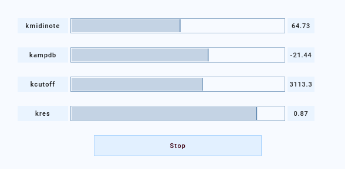

Synth
=====

A Synth is a wrapper for a unique event scheduled via a Session.

.. note::
 
    A user **does not normally create a Synth**: a Synth is created when an
    :class:`~csoundengine.instr.Instr` is scheduled in a Session via
    :meth:`~csoundengine.session.Session.sched`

**The lifetime of the underlying csound event is not bound to the Synth
object**. In order to stop a synth its :meth:`~csoundengine.synth.Synth.stop` method
must be called explicitely

Examples
--------

Automate a synth
~~~~~~~~~~~~~~~~

.. code-block:: python

    from csoundengine import *
    from pitchtools import ntom
    session = Engine().session()
    session.defInstr('vco', r'''
        |kamp=0.1, kmidi=60, ktransp=0|
        asig vco2 kamp, mtof:k(kmidi+ktransp)
        asig *= linsegr:a(0, 0.1, 1, 0.1, 0)
        outch 1, asig
    ''')
    notes = ['4C', '4D', '4E']
    synths = [session.sched('vco', kamp=0.2, kmidi=ntom(n)) for n in notes]
    # synths is a list of Synth
    # automate ktransp in synth 1 to produce 10 second gliss of 1 semitone downwards
    synths[1].automate('ktransp', [0, 0, 10, -1])

Autogenerate a ui to explore a synth
~~~~~~~~~~~~~~~~~~~~~~~~~~~~~~~~~~~~

.. code-block:: python

    # Inside jupyter
    from csoundengine import *
    s = Engine().session()
    s.defInstr('vco', r'''
      |kmidinote, kampdb=-12, kcutoff=3000, kres=0.9|
      kfreq = mtof:k(kmidinote)
      asig = vco2:a(ampdb(kampdb), kfreq)
      asig = moogladder2(asig, kcutoff, kres)
      asig *= linsegr:a(0, 0.1, 1, 0.1, 0)
      outs asig, asig
    ''')
    synth = s.sched('vco', kmidinote=67)
    # Specify the ranges for some sliders. All named parameters
    # are assigned a widget
    synth.ui(kampdb=(-48, 0), kres=(0, 1))

Generated ui when working in the terminal:

Generated ui inside jupyter:

.. figure:: assets/synthui.png

-------------------------------------

SynthGroup
==========

A :class:`~csoundengine.synth.SynthGroup` is used to control multiple synths.
Such multiple synths can be groups of similar synths (as in additive synthesis),
or processing chains which work as an unity

A :class:`~csoundengine.synth.SynthGroup` behaves very similar to a synth but its
effects encompass all the synths within it. For example, calling its
:meth:`~csoundengine.synth.SynthGroup.stop` method will stop all the synths in the
group. Calling :meth:`~csoundengine.synth.SynthGroup.set` will modify dynamic
parameters for all the synths in the group which declare such a parameter

-----

.. automodule:: csoundengine.synth
    :members:
    :inherited-members:
    :autosummary:

